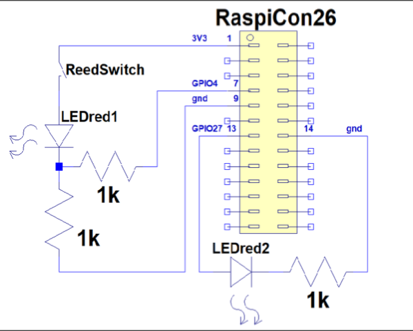

# Gas Meter

Keeps track of the gas meter reading and performance by using a reed-contact.

Das Programm Gasmeter laeuft parallel zu einem Gaszaehler auf jedem bisher erschienenen Raspi. Der Wechsel des Zaehlerstandes wird per Reed-Kontakt erfasst. Die momentane Leistung wird aus dem zeitlichen Abstand der Zaehlimpulse berechnet. Das Programm ist mit node-RED erstellt und benutzt die Erweiterung "Dashboard", /ui . Die Benutzeroberflaeche /ui erlaubt Debug-Einstellungen, einen Simulationsmodus für permanenten Gasfluss und manuelles Ueberschreiben des Reed-Kontaktes. Die Ergebnisse werden grafisch über die letzten 4, 48 und 120 Stunden und in einer Monatsgrafik dargestellt. Die Rohdaten wandern zur genaueren spaeteren Auswertung in 4 unterschiedliche Logfiles.

Die Beschreibung der externen Beschaltung gibt es hier auch als ASCII Schaltplan. Die Nummer der Pins des Raspi I/O Pfostensteckers in Klammern :

+3,3 Volt (1, rot)---xReedx---I>LED>I---+---I 1KOhm I---Ground (9, schwarz)   
GPIO04 Pin (7, gelb)------I 1KOhm I-----+  
(als Eingang geschaltet )

Die LED1 geht an, sobald der Reed-Kontakt schaltet. Über einen 1 KOhm Widerstand geht das Signal an den Pin GPIO04 (Pin 7) des Raspi.

Ein anderer freier I/O Pin (Pin 13) treibt als Ausgang ueber einen 1 KOhm Widerstand eine an Ground (Pin 25) angeschlossene LED2, siehe unten. Diese LED2 blinkt im 10 Sekunden-Takt ("Heart-Beat") und bei jedem Signalwechsel des Reedkontaktes.

Eine Schritt-fuer-Schritt Anleitung zur Installation auf einem Raspi wird auf Anforderung gerne erstellt.

Mehr Infos und Fotos :

https://sites.google.com/site/heizungregelung/allgemeines/gaszaehler

Hier sind moegliche Erweiterungen gelistet (etwas aktueller als "Zukunft", siehe unten) :

https://sites.google.com/site/heizungregelung/allgemeines/gaszaehler/gas_pl%C3%A4ne

Wer immer diese Erweiterungen schon vorgenommen hat, bevor ich sie einbauen konnte : Ich übernehme sie gerne.

Zukunft :

1. Diagramme weiter optimieren.
1. Dividend und andere Konstante optional per Einlesen aus Datei, aequivalent zur Ini Datei, und aenderbar über die /ui. So, wie das jetzt schon mit dem Zaehlerstand passiert.
1. Programm fit machen, um die Werte per WEB abzuholen. Per Homeassistant oder dergleichen.
1. Beim Start den letzten Zaehlerstand aus Protokolldatei lesen.
1. Die 4 Protokolldateien nur wahlweise schreiben, um die SD-Karte zu schonen.
1. Diagramm-Breiten besser an iPhone und iPad anpassen.
1. Datei mit aequidistanten Messwerten wahlweise, Aufzeichnungsstop nach 20 Minuten Leerlauf.
1. Git auch lokal benutzen : https://nodered.org/docs/user-guide/projects/
1. Mqtt ?
1. Lorawan ?
1. Welche Auswerte Software ?
1. Ausprobieren : Uni- and Bipolar Hall IC Switches for Magnetic Field Applications, als Alternative zu einem Reedkontakt :TLE4905L, TLE4935L, TLE4945L, TLE4945-2L.
1. Magnetsensor mit I2C Interface (QMC5883 Magnetometer oder so) ?

Ekkehard@Pofahl.de
